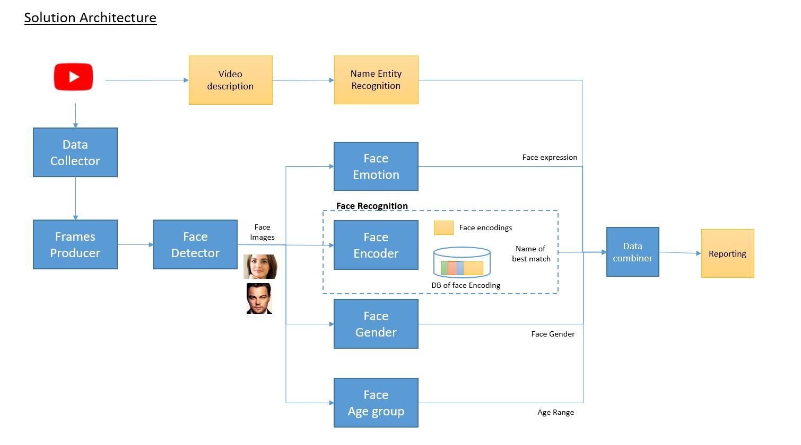

# Face Analytics

In this project we are extracting insights from advertisement videos.

This has implementation of following computer vision usecases:
- Face Detection
- Face Recognition
- Gender Classification
- Emotion Recognition

_To Run this on your video update video path in app.py file._

### Getting Started
 
 #### Installations:
 1. Create a anaconda environment
 2. install dlib for face detection
 3. pip install -r requirements.txt
 4. download pre-trained model from [link](https://drive.google.com/open?id=1EXPBSXwTaqrSC0OhUdXNmKSh9qJUQ55-) provided by facenet implementation at [here](https://github.com/davidsandberg/facenet)
 5. extract model in models/facenet_model folder 
 
 #### Running it
 After installations run app.py file
 It will take video from youtube, process it & save it in output.avi file
 
 #### High Level Flow Chart
 

#### Sample Output

The output video will have bounding box around face, with data generated by different models.

#### To-Do:
1. Add references
2. Add content on how to use config file

#### References & Credits
1. [VGG Face2 Dataset](http://www.robots.ox.ac.uk/~vgg/data/vgg_face2/)
2. [David Sandberg Facenet implementation](https://github.com/davidsandberg/facenet)